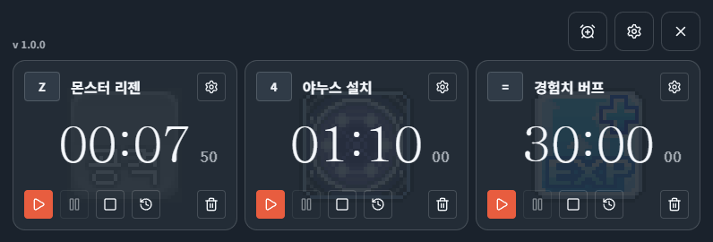

  

  <h1>메소워치</h1>

  <h3>메이플스토리 재획 타이머</h3>
  
몬스터 리젠, 설치형 스킬 재사용, 경험치 버프 재사용 등  
메이플스토리 재획 중 반복되는 타이밍을 여러 개 등록해두고 관리하는 타이머 오버레이 앱

  
  
  
  

## 시작하기

- [WEB 버전](https://sj70.github.io/meso-watch/) - 브라우저에서 바로 사용 가능  

- [Windows 오버레이 앱](https://github.com/SJ70/meso-watch/releases) - 인게임 입력 감지 가능  

## 사용 예시

| 항목 | 타이머 시간 | 재사용 단축키 설정 |
|---|---|---|
| **몬스터 리젠** | 7.5초 | 주요 사냥기 단축키 |
| **야누스 설치** | 1분 10초 | 야누스 설치 단축키 |
| **경험치 버프** | 30분 | 경험치 버프 시퀀스 단축키 |

> 야누스 20레벨 기준 지속시간 80초 - 설치 시간 여유 10초

[유튜브 시연 영상](https://youtu.be/8Kt6kGQBBvA)

## 주요 기능

### 타이머

- 여러 개의 타이머 생성·관리, 드래그로 순서 변경
- 타이머별 이름 / 시간(프리셋 또는 마우스 휠 조절) / 재시작 단축키 / 알람음 / 볼륨 / 배경 아이콘 설정
- 처음 실행 시 자주 쓰는 기본 타이머 3종(몬스터 리젠, 야누스 설치, 경험치 버프) 자동 생성

### 타이머 알람
- 타이머 만료 시 반복 알람 + 카드 점멸·튕김 애니메이션
- 알람음 8종 중 선택 가능
- 타이머별 볼륨은 마스터 볼륨의 배수로 조절

### Windows 오버레이 앱
- 화면 위에 항상 떠 있는 투명 오버레이, 배경/버튼 투명도 조절
- 게임 조작키를 그대로 단축키로 등록해도 게임 입력을 막지 않음 — Raw Input 기반으로 관찰만 하고 가로채지 않음

## 기술 스택

- **프론트엔드**   
- **데스크톱 런타임** 
- **패키징** 
- **입력 감지** 
- **패키지 매니저** 

## 라이선스

[GPL-3.0](LICENSE) — 자유롭게 사용·수정·재배포할 수 있으나, 파생물도 동일하게 GPL-3.0으로 공개해야 합니다.

## 고지

메소워치는 넥슨과 무관한 비공식 팬 제작 도구이며, 사용으로 발생하는 어떠한 결과에도 책임지지 않습니다.  
MapleStory 및 관련 저작물에 대한 권리는 ㈜넥슨코리아에 있습니다.